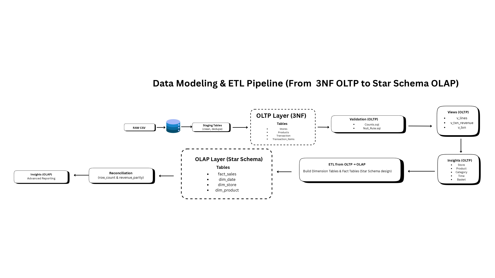
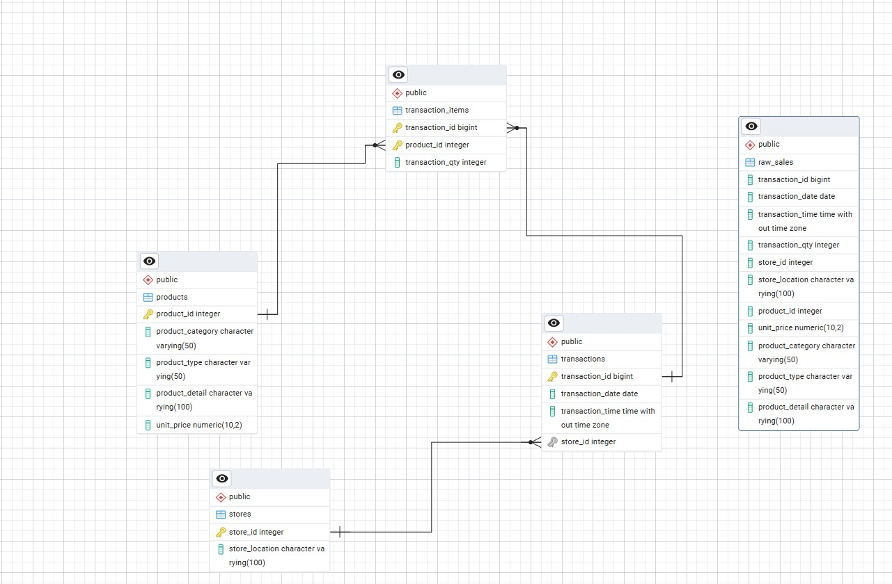
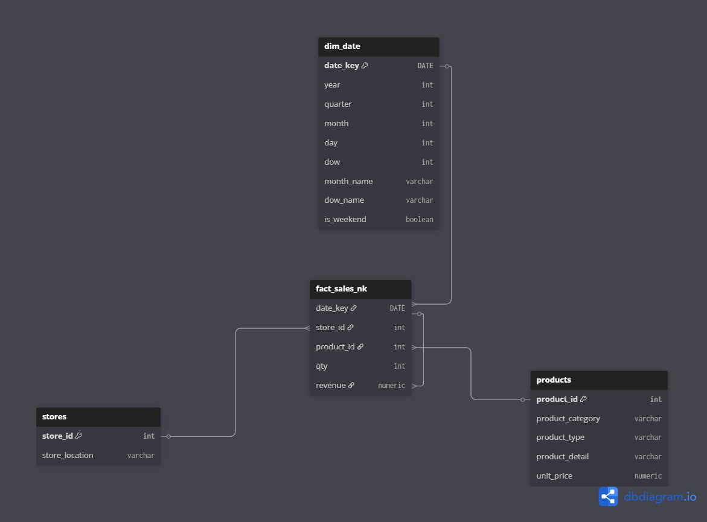
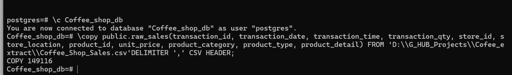

# Coffee Shop Sales - Data Engineering Project  
*ETL pipeline, OLTP (3NF), OLAP (Star Schema), and SQL-based insights generation*

## 1. Objective

* The objective of this project was to design and implement a complete data modeling and ETL pipeline for a transactional dataset. The project demonstrates how raw transactional data can be structured into an OLTP system (3NF) for integrity and then transformed into an OLAP system (Star Schema) for advanced analytics and business insights.

* The dataset used is the Coffee Shop Sales dataset - https://mavenanalytics.io/data-playground/coffee-shop-sales, containing 149,116 records and 11 variables. It was chosen because it offers rich transactional detail across stores, products, and dates, which is well-suited for ETL and data modeling demonstrations.

---

## 2. Where this methodology can be applied

This approach is widely applicable to:

**-> Retail and e-commerce companies** - Analyzing store and product performance.

**-> Hospitality & restaurants** - Tracking orders, inventory usage, and customer patterns.

**-> Finance and banking** - Separating transactional OLTP systems from OLAP analytical warehouses.

**-> Any enterprise with high transaction volume** - Ensuring clean operational data in OLTP and fast reporting in OLAP.

---

## 3. Tools Used:

**-> PostgreSQL** - Database for OLTP and OLAP layers.

**-> PgAdmin** - Interface for queries and validation.

**-> Git & GitHub** - Version control and repository management.

**-> dbdiagram.io** – ERD visualization.

**-> SQL** - For ETL, indexing, QA, and insights.

---

## 4. Data Pipeline Workflow

The workflow was designed to extract, transform, and load data through different layers:

1. Load raw CSV into PostgreSQL.

2. Normalize data into 3NF (OLTP layer).

3. Validate counts, null rules, and consistency.

4. Transform into Star Schema (OLAP layer).

5. Reconcile parity between OLTP and OLAP (row count & revenue).

6. Generate insights from both layers.

**ETL Pipeline:** 

---
## 5. Why 3NF for OLTP

 **Reasons for 3NF**
 
    * Data integrity -> Ensures there is no redundant or duplicate data. Each piece of information is stored only once. 

    * Consistency-> Updates and deletions are easier to manage without causing anomalies.

    * Efficient transactions -> OLTP systems require fast inserts, updates, and deletes. Normalized structures are best suited for this. 

    * Scalability -> As data grows, normalization reduces unnecessary storage overhead.

ERD (3NF OLTP Layer):
 

## 6. Why Star Schema for OLAP?

**Reasons for star schema**
   
    * Simplified queries ->  Joins between fact and dimensions are straightforward, which improves usability for analysts.
   
    * Analytical efficiency -> Optimized for aggregations, reporting, and slicing data across dimensions like product, store, and time.
   
    * BI compatibility ->  Most business intelligence tools (Power BI, Tableau) are built to work directly with star schemas.
   
    * Performance ->  By pre-structuring data for analysis, star schemas allow faster queries compared to highly normalized OLTP tables.
   
**ERD (Star Schema OLAP Layer):**

---

## 7. Data Loading

The dataset was loaded into PostgreSQL using the \copy command.

---

## 8. OLTP Layer (3NF Normalization)

**Indexing**

Created indexes on:

* transactions(store_id)

* transaction_items(product_id)

**QA & Validation**

* Checked row counts for consistency.

* Applied null rules to ensure completeness of key attributes.

**Insights from OLTP**

The dataset contained 11 variables across transactions, stores, and products. Our analysis focused on five main business dimensions:

    1. Store performance - Which stores drive the most revenue?

    2. Product performance - Which items are best sellers?

    3. Category & price mix - How do categories and price bands contribute to sales?

    4. Time trends - When do customers buy the most (day/hour)?

    5. Basket metrics - How much do customers typically spend per visit?
---

**1. Store Performance**

* Hell’s Kitchen leads with 33.85% of total revenue, followed by Astoria (33.21%) and Lower Manhattan (32.93%).

* Monthly revenue showed steady growth across all three stores.

* Each store has its own leading product (Dark Chocolate Lg in Astoria & Lower Manhattan, Civet Cat in Hell’s Kitchen)

**2. Product Performance**

* Sustainably Grown Organic Lg ($21.1k) and Dark Chocolate Lg ($21.0k) were top sellers.

* The top 10 products together contributed 25% of total revenue.

**3. Category Mix**

* Coffee ($270k) and Tea ($196k) are the largest categories.

* Mid-priced products ($3–$5) dominated with $464k revenue (63% of total).

**4. Time Trends**

* Peak sales were between 8 - 10 AM (morning rush).

* Weekdays slightly outperformed weekends in overall revenue.

**5. Basket Metrics**

* Average basket size is between 1 - 2 items per transaction.

* Average order value (AOV) is between $4 - $5.

**Key Findings**
 
  OLTP analysis revealed balanced store contributions, dominance of mid-priced coffee/tea, strong weekday morning demand, 
  and modest basket sizes, highlighting cross-sell/upsell opportunities.

---

## 9. OLAP Layer (Star Schema)

**Schema Overview**

* **Fact table:** fact_sales

* **Dimensions:** dim_date, store, product

---
**Indexing**

Indexes created on dimension keys for faster joins.

---

**OLAP Parity Validation and Insights**

* To ensure accuracy, a parity check was performed between OLTP (3NF) and OLAP (Star Schema).
* The results matched exactly, confirming no data loss or duplication during ETL.

* From the above result, it can be implied that: 

      * OLAP can now be trusted for dashboards and advanced analytics.

      * Insights generated are consistent across both OLTP and OLAP.

      * This forms the foundation to build BI dashboards (Power BI/Tableau) and predictive modeling in Python

---

## 10. Future Implementation

* The current project established a clean OLTP and OLAP pipeline. 

* The next steps focus on analytics and predictive modeling using the OLAP layer as the source of truth.

---

**Future_Pipeline**

---

**Exploratory Data Analysis (EDA):**

Use SQL queries and Python (pandas, matplotlib, seaborn) to explore OLAP data for deeper business understanding.

---

**Supervised ML Models:**

**1.Linear Regression** - Forecasting future sales trends.

**2. Random Forest & XGBoost** - Predicting product performance and customer demand with higher accuracy.

**3. Model Performance & Evaluation** - Compare models using metrics (e.g., RMSE, R^2, accuracy) 
to ensure reliable predictions. Use results to recommend pricing strategies and product placement.

---

**Dashboards (BI):**

-> Connecting  the OLAP layer to Power BI to build interactive dashboards for:
 
 * Store-level comparisons
 * Category/product drill-downs
 * Time-based trend analysis

-> This future pipeline will combine predictive modeling with real-time dashboards, making the system useful for 
both strategic planning and operational monitoring.

---
## 11. Key Findings & Future Outlook

**From Current Work:**  
- Hell’s Kitchen, Astoria, and Lower Manhattan each contribute 33% revenue.  
- Coffee and Tea dominate category sales, with mid-priced items ($3 - $5) leading revenue.  
- Sales peak 8 - 10 AM on weekdays.  
- Average basket size = 1.44 items and avg order value = $4.68.  

**From Future Extensions:**  
- Build predictive models (Linear Regression, Random Forest, XGBoost) for sales forecasting.  
- Use BI dashboards (Power BI/Tableau) for store/product/time-based drilldowns.  
- Combine ML + BI to enable strategic planning and real-time monitoring.

---
